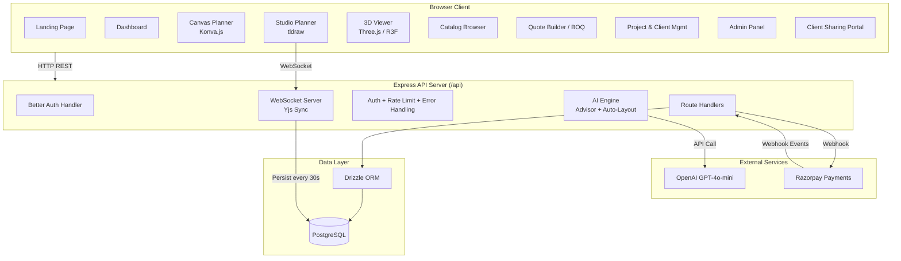
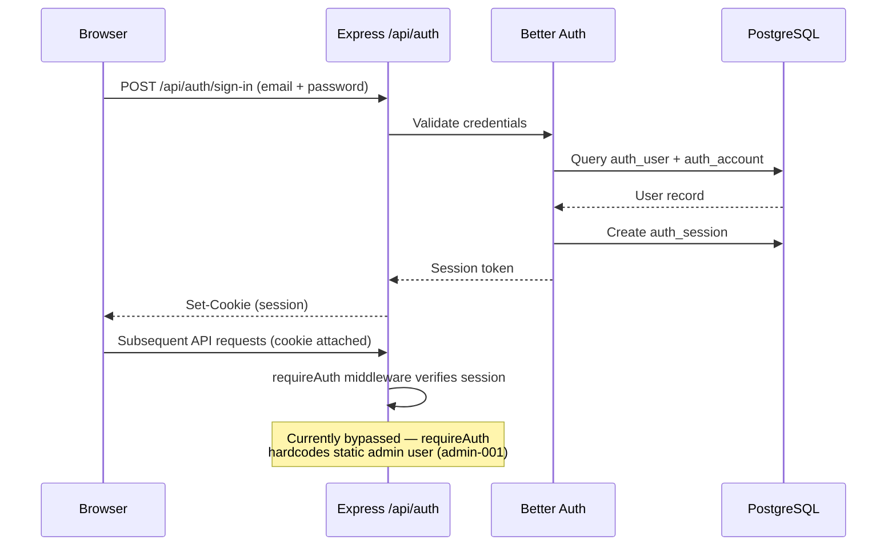
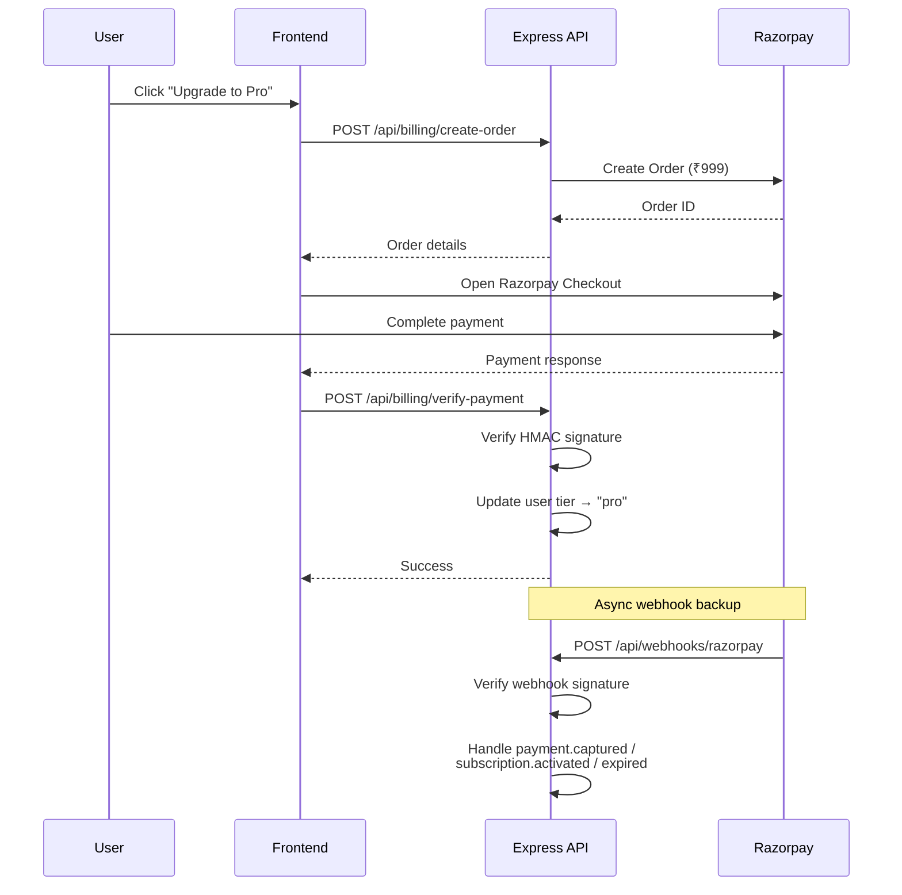
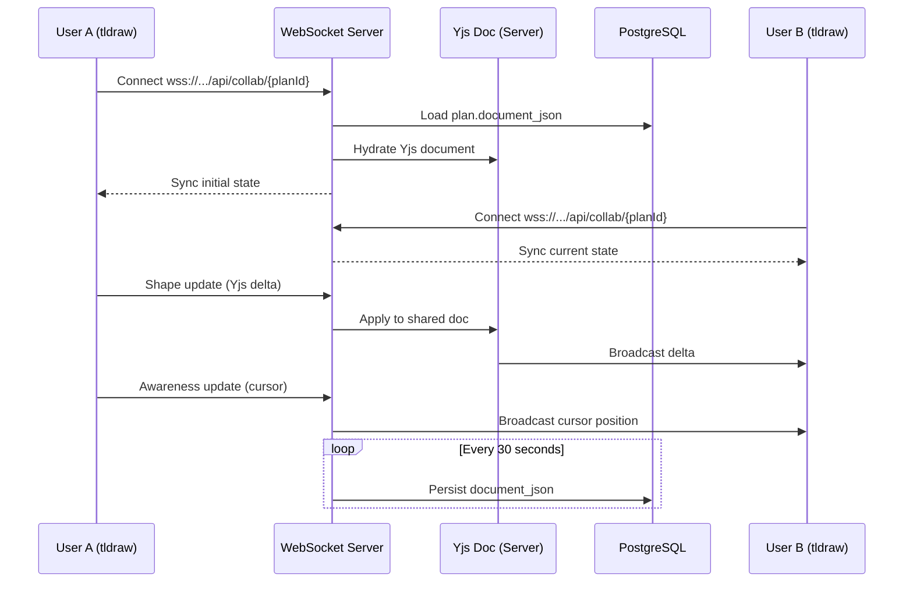
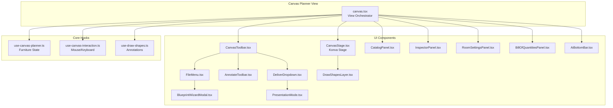
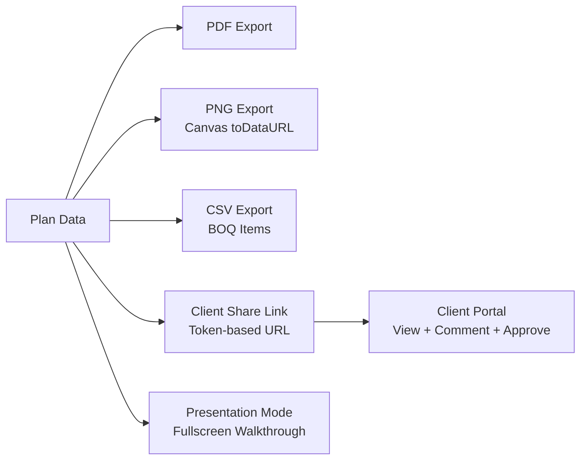
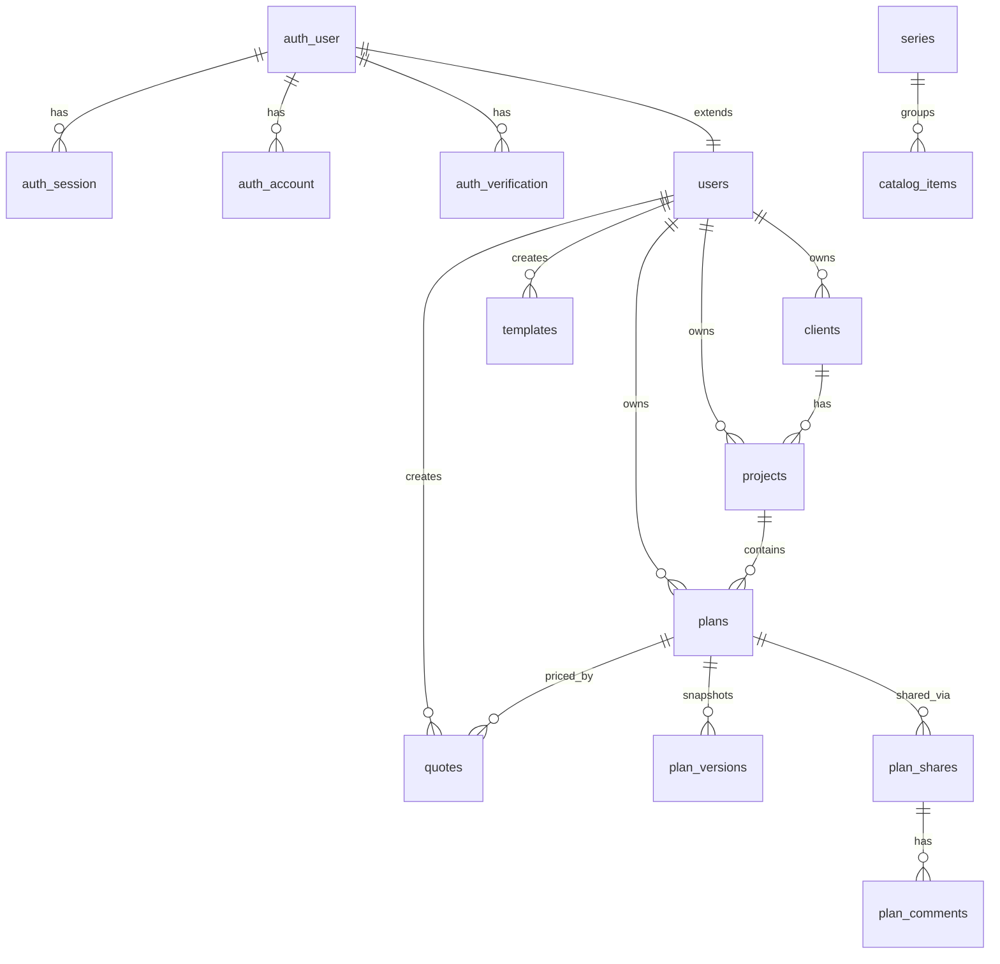

# Office Planner Suite — Project Handover Document

> **Document date:** April 13, 2026. Counts, endpoints, and implementation details reflect the codebase as of this date and may have changed since.

---

## Table of Contents

1. [Executive Summary](#1-executive-summary)
2. [Technical Architecture Flowchart](#2-technical-architecture-flowchart)
3. [Detailed System Walkthrough](#3-detailed-system-walkthrough)
4. [API Reference Summary](#4-api-reference-summary)
5. [Database Schema Overview](#5-database-schema-overview)
6. [Frontend Architecture](#6-frontend-architecture)
7. [Environment & Deployment](#7-environment--deployment)
8. [Known Limitations & Future Work](#8-known-limitations--future-work)

---

## 1. Executive Summary

### What It Is

The **Office Planner Suite** (branded as **One&Only / oando.co.in**) is a unified office-planning SaaS application that lets interior designers, workspace consultants, and facility managers design office floor plans, furnish them from a real product catalog, generate quotes, and collaborate with clients — all from a single browser-based platform.

### Who It's For

- **Interior designers & space planners** creating office layouts
- **Furniture dealers** (primarily AFC India catalog) selling workstations and furnishings
- **Facility managers** managing multiple office projects
- **Clients** reviewing and approving proposed designs via a sharing portal

### Key Capabilities

| Capability | Description |
|---|---|
| **Landing Page** | SEO-optimised marketing page with JSON-LD structured data |
| **Dashboard** | Activity feed, plan statistics, quick actions |
| **Planner Canvas** | Konva.js-based 2D floor plan editor with drag-and-drop furniture placement |
| **Planner Studio** | tldraw-based collaborative vector editor with real-time multi-user editing |
| **3D Viewer** | Three.js / React Three Fiber 3D visualisation of plans |
| **Blueprint Wizard** | Multi-step guided setup for new plans (room type, dimensions, furniture series) |
| **AFC India Catalog** | 83 real products across 7 categories with tier-based filtering |
| **Quote Builder / BOQ** | Bill of Quantities with automatic cost calculation and PDF/CSV export |
| **Client & Project Management** | CRM-lite: clients, projects, plan hierarchy |
| **Client Sharing Portal** | Token-based public links with view tracking, comments, and approval flow |
| **Admin Panel** | User management, catalog administration, system metrics |
| **Payments / Subscriptions** | Razorpay integration with free/pro tiers (₹999/month) |
| **Real-time Collaboration** | Yjs CRDT + WebSocket for multi-user editing with live cursors |
| **AI Advisor** | Spatial analysis, ergonomic guidance, and auto-layout generation (GPT-4o-mini + rule-based fallback) |
| **Version History** | Snapshot-based plan versioning with restore capability |
| **Annotations & Presentation** | Drawing tools, measurement overlays, and fullscreen presentation mode |
| **Export Pipeline** | PDF, PNG, and CSV export of plans and quotes |

### Tech Stack

| Layer | Technology |
|---|---|
| Frontend | Next.js 16 (App Router), React 19, TypeScript |
| Styling | Tailwind CSS 4, CSS token variables |
| Canvas Editor | Konva.js |
| Studio Editor | tldraw |
| 3D Viewer | Three.js / React Three Fiber |
| State Management | Zustand, React Query (TanStack Query) |
| API Codegen | Orval (OpenAPI → React Query hooks) |
| Backend | Express 5, TypeScript |
| Database | PostgreSQL + Drizzle ORM |
| Auth | Better Auth (email + password) |
| Payments | Razorpay |
| Real-time | Yjs + y-websocket |
| AI | OpenAI GPT-4o-mini (with rule-based fallback) |
| Logging | Pino |
| Monorepo | pnpm workspaces |

---

## 2. Technical Architecture Flowchart

### 2.1 High-Level System Architecture



### 2.2 Authentication Flow

> **Current state:** Authentication is disabled for development. The API middleware hardcodes a static admin user for all requests (see Section 3.10). The diagram below shows the _intended_ Better Auth flow when auth is re-enabled.



> **Frontend middleware note:** The Next.js middleware (`src/lib/auth-middleware.ts`) currently only redirects `/sign-up` to `/` — it does not enforce authentication on protected routes. All protected-route enforcement is intended to happen at the API layer.

### 2.3 Payment / Subscription Flow



### 2.4 Real-Time Collaboration Architecture



### 2.5 Planner Canvas Module Structure



### 2.6 File & Export Pipeline



---

## 3. Detailed System Walkthrough

### 3.1 Landing Page

**Route:** `/` (unauthenticated)  
**View:** Marketing landing page with hero section, feature highlights, and call-to-action.

- Built with dedicated components in `src/components/landing/`
- Includes `JsonLd` component for SEO structured data (`src/components/json-ld.tsx`)
- Responsive design using Tailwind CSS with the project's dark professional theme (deep navy tones, clean whites)
- CSS variables defined in `src/styles/theme-tokens.css` — no hardcoded hex/rgba values

### 3.2 Dashboard

**Route:** `/` (authenticated, inside protected layout)  
**View:** `src/views/home.tsx`

- Displays plan statistics (total plans, recent activity)
- Quick-action cards for creating new plans
- Activity feed showing recent changes across projects
- Protected by the `(protected)/layout.tsx` wrapper which provides the sidebar navigation

### 3.3 Planner Studio (tldraw-based)

**Route:** `/planner/studio`  
**View:** `src/views/planner/studio.tsx`  
**Feature Module:** `src/features/planner/`

#### Canvas Editor
- **`StudioPlanner.tsx`** — Orchestrates the tldraw editor instance
- **`planner-store.ts`** — Zustand store managing: active tool, zoom level, catalog panel state, collaboration status, selected items
- **`useCollaboration.ts`** — Synchronises tldraw store with Yjs shared document; manages awareness protocol for live cursors
- **`CollaboratorCursors`** — Renders remote user cursors in real-time

#### 3D View
- **`Studio3DView.tsx`** — Three.js / React Three Fiber integration
- Renders the 2D plan as a 3D walkthrough with extruded walls and furniture models
- Accessible from the studio toolbar or via `/viewer/3d`

### 3.4 Planner Canvas (Konva-based)

**Route:** `/planner/canvas`  
**View:** `src/views/planner/canvas.tsx`

The primary 2D editor uses Konva.js for high-performance HTML5 Canvas rendering.

**Core Hooks:**
- `use-canvas-planner.ts` — Manages furniture items (add, move, rotate, delete, snap-to-grid)
- `use-canvas-interaction.ts` — Mouse/keyboard event handling (select, drag, multi-select, zoom, pan)
- `use-draw-shapes.ts` — Annotation layer state (line, rect, ellipse, text tools)

**Key Components:**
- `CanvasStage.tsx` — Konva `<Stage>` with room boundary, grid overlay, and furniture layers
- `CanvasToolbar.tsx` — Top bar with undo/redo, zoom controls, grid toggle, measurement tool, annotation toggle, File menu, Deliver dropdown, Save
- `InspectorPanel.tsx` — Right sidebar listing all placed items with property editing
- `RoomSettingsPanel.tsx` — Floating panel to set room dimensions (width/depth in cm)
- `DrawShapesLayer.tsx` — Konva layer rendering annotation shapes
- `AnnotateToolbar.tsx` — Tool selector for annotation shapes (line, rectangle, ellipse, text)

### 3.5 Blueprint Wizard

**Route:** Launched as modal from File → New Blueprint  
**View:** `src/views/planner/blueprint.tsx`  
**Component:** `BlueprintWizardModal.tsx`

Multi-step wizard that guides new plan creation:
1. Select room type (Open Office, Conference, Executive, Reception, Training, Breakout)
2. Enter room dimensions (width × depth in cm)
3. Choose furniture series and categories from the AFC catalog
4. AI suggests appropriate items based on room type
5. Generates initial layout and opens in the canvas editor

### 3.6 Catalog & Products

**Route:** `/catalog`  
**View:** `src/views/catalog.tsx`  
**Component:** `CatalogPanel.tsx` (in-planner sidebar)

- 83 real products from AFC India (afcindia.in) across 7 categories:
  - Workstations (18), Tables (14), Storage (12), Seating (13), Soft Seating (11), Educational (5), Accessories (10)
- Tier-based series: Economy, Medium, Premium
- Sub-category filtering and search
- Product images from AFC CDN
- Database seed: `lib/db/src/seed-afc.ts`
- In the planner, the catalog appears as a floating sidebar panel; drag items onto the canvas to place them

### 3.7 Quote Builder / Bill of Quantities (BOQ)

**Component:** `BillOfQuantitiesPanel.tsx`  
**API:** `GET /api/plans/:id/quote/preview` (live preview), `POST /api/plans/:id/quote` (persist), `GET /api/quotes/:id`

- Automatically tallies all items placed on the current plan
- Shows: item name, quantity, dimensions, category
- Calculates subtotal, GST (18%), and grand total
- Export to PDF and CSV via the Deliver dropdown
- Quotes are persisted and linked to plans in the `quotes` table
- Client-facing quotes can be shared via the sharing portal

### 3.8 Client & Project Management

**Routes:** `/clients`, `/projects`, `/projects/:id`  
**Views:** `src/views/projects.tsx`, `src/views/project-detail.tsx`

- **Clients:** Name, company, email, phone, address — linked to the current user
- **Projects:** Group multiple plans under a client; track status (active, completed, archived)
- **Hierarchy:** Client → Project → Plan → Versions / Quotes / Shares
- Full CRUD operations via API endpoints

### 3.9 Admin Panel

**Route:** `/admin`  
**Middleware:** `require-admin.ts` (role-based access control)

- User management (view all users, roles, subscription status)
- Catalog administration (add/edit/remove products and series)
- System metrics and usage statistics
- Protected by admin role check in API middleware

### 3.10 Authentication & Subscriptions

**Auth Stack:** Better Auth with Drizzle adapter for PostgreSQL  
**Routes:** `/sign-up` (frontend — combined sign-in/sign-up page), `/api/auth/*` (backend)

- Email + password authentication via Better Auth
- Session-based (cookie) with `auth_session` table
- Frontend auth client: `src/lib/auth-client.ts` (Better Auth React client)
- The sign-in/sign-up page at `/sign-up/[[...sign-up]]/page.tsx` is a single component that toggles between sign-in and sign-up modes
- **Current state:** Auth is **fully disabled** for development:
  - The `requireAuth` middleware (`require-auth.ts`) hardcodes a static admin user (`admin-001`, `ayush@oando.co.in`, role `admin`) and injects it into every request — no session validation occurs
  - The Next.js middleware redirects `/sign-up` to `/`, effectively hiding the auth page
  - All API requests are treated as coming from the same admin user
  - There is no frontend route guard — no protected-route enforcement on the client side

**Subscriptions:**
- Two tiers: **Free** and **Pro** (₹999/month)
- Razorpay integration for payment processing
- `use-subscription.ts` hook exposes `isPro` status to gate premium features
- Webhook handler processes `payment.captured`, `subscription.activated`, `subscription.expired` events

### 3.11 AI Advisor

**Route:** `/api/ai/advisor`, `/api/ai/auto-layout`  
**Components:** `AiBottomBar.tsx`, `AiToolsPanel.tsx`

#### Proactive Tips (Client-Side)
- Real-time spatial monitoring of the canvas
- Alerts for: floor coverage percentage, workstation capacity, overlapping items, wall proximity issues
- No server roundtrip — pure geometric analysis in the browser

#### On-Demand Advisor (Server-Side)
- Users type questions or request a review
- Backend runs `runSpatialAnalysis` (geometric checks) + `generateAdvice` (rule-based engine)
- Returns categorised feedback: Issues (red), Suggestions (yellow), Positives (green)
- Supports room-type-specific advice (Open Office, Conference, Executive, etc.)

#### Auto-Layout Generation
- **Primary:** GPT-4o-mini generates furniture placements given room dimensions, type, and catalog
- **Fallback:** Procedural rule-based generator if LLM is unavailable
- **Validation:** Every layout is checked for overlaps and boundary violations before display
- Constraint-aware: desk spacing (150cm), walkway widths (90cm), wall clearances (30cm)

### 3.12 Version History

**API:** `/api/plans/:id/versions`  
**Hook:** `use-plan-versions.ts`

- Snapshot-based: saves a full `document_json` copy with an incrementing `version_number`
- Optional `thumbnail_url` for visual preview
- Users can browse version history and restore any previous snapshot
- Stored in `plan_versions` table, linked to parent plan by `plan_id`

### 3.13 Client Sharing Portal

**Routes:** `/share/:token` (public), `/api/shares`, `/api/public-shares`  
**Schema:** `plan_shares`, `plan_comments` tables

- Generates unique share tokens with optional expiry
- Public portal (no login required) allows clients to:
  - View the plan in read-only mode
  - Leave positional comments (x, y coordinates on the plan)
  - Approve or request changes
- View tracking: records when and how many times a share link is accessed
- Status flow: pending → viewed → approved / revision-requested

### 3.14 Collaboration System

- Built on **Yjs** (CRDT framework) with **y-websocket** transport
- Server-side: `artifacts/api-server/src/collab.ts`
  - `WebSocketServer` on upgrade path `/api/collab/:planId`
  - Hydrates Yjs document from `plans.document_json` on first connection
  - Auto-persists changes every 30 seconds
  - Manages awareness protocol (cursor positions, user presence)
- Client-side: `useCollaboration.ts` hook in `src/features/planner/`
  - Synchronises tldraw store changes bidirectionally with Yjs `shapesMap`
  - Renders remote cursors via `CollaboratorCursors` component
- Available only in the Studio (tldraw) planner, not the Canvas (Konva) planner

---

## 4. API Reference Summary

All routes are prefixed with `/api`. Routes below the `requireAuth` middleware line require authentication.

### Public Routes (No Auth Required)

| Route Group | Purpose | Endpoints |
|---|---|---|
| **Health** | Liveness/readiness check (includes DB connectivity) | `GET /healthz` |
| **Catalog (browse)** | Product browsing and search | `GET /catalog` (list items, supports `?category=`, `?subCategory=`, `?search=`), `GET /catalog/:id`, `GET /catalog/categories`, `GET /catalog/series`, `GET /catalog/series/:id` |
| **Webhooks** | External service callbacks | `POST /webhooks/razorpay` |
| **Public Shares** | Client portal access (no auth) | `GET /share/:token`, `POST /share/:token/comments`, `POST /share/:token/approve` |

### Protected Routes (Auth Required)

| Route Group | Purpose | Endpoints |
|---|---|---|
| **Users** | Profile sync and retrieval | `POST /users/sync`, `GET /users/me` |
| **Plans** | Plan CRUD, stats, and duplicate | `GET /plans`, `POST /plans`, `GET /plans/:id`, `PATCH /plans/:id`, `DELETE /plans/:id`, `GET /plans/stats`, `POST /plans/:id/duplicate` |
| **Plan Versions** | Snapshot history and restore | `GET /plans/:id/versions`, `POST /plans/:id/versions`, `GET /plans/:id/versions/:versionId`, `POST /plans/:id/versions/:versionId/restore` |
| **Quotes** | BOQ pricing and quote generation | `GET /plans/:id/quote/preview`, `POST /plans/:id/quote`, `GET /quotes`, `GET /quotes/:id` |
| **AI** | Advisor and auto-layout | `POST /ai/advisor`, `POST /ai/auto-layout` |
| **Templates** | Pre-built layouts | `GET /templates` (supports `?category=`), `GET /templates/:id`, `POST /templates/:id/use` |
| **Clients** | Client management | `GET /clients` (supports `?search=`), `POST /clients`, `GET /clients/:id`, `PATCH /clients/:id`, `DELETE /clients/:id` |
| **Projects** | Project management | `GET /projects` (supports `?clientId=`, `?status=`), `POST /projects`, `GET /projects/:id`, `PATCH /projects/:id`, `DELETE /projects/:id` |
| **Subscriptions** | Razorpay billing | `GET /billing`, `POST /billing/create-order`, `POST /billing/verify-payment`, `POST /billing/cancel` |
| **Shares** | Internal share management | `POST /plans/:id/share`, `GET /plans/:id/shares`, `DELETE /plans/:id/shares/:shareId` |

### Admin Routes (Auth + Admin Role Required)

| Route Group | Purpose | Endpoints |
|---|---|---|
| **Admin Users** | User management and system stats | `GET /admin/users`, `PATCH /admin/users/:id/role`, `GET /admin/stats` |
| **Admin Catalog** | Catalog item CRUD | `POST /admin/catalog`, `PATCH /admin/catalog/:id`, `DELETE /admin/catalog/:id` |
| **Admin Series** | Product series CRUD | `POST /admin/series`, `PATCH /admin/series/:id`, `DELETE /admin/series/:id` |
| **Admin Templates** | Template management | `PATCH /admin/templates/:id`, `DELETE /admin/templates/:id` |

### Authentication Routes (Handled by Better Auth)

| Path | Purpose |
|---|---|
| `/api/auth/*` | All Better Auth endpoints (sign-in, sign-up, sign-out, session, etc.) |

### WebSocket Endpoint

| Path | Purpose |
|---|---|
| `wss://<host>/api/collab/:planId` | Yjs real-time collaboration sync |

### Rate Limits

- **General API:** 300 requests / 15 minutes
- **Auth endpoints:** 30 requests / 15 minutes

---

## 5. Database Schema Overview

PostgreSQL database managed with **Drizzle ORM**. Schema files located in `lib/db/src/schema/`.

### Tables & Relationships



### Table Details

#### Authentication (`schema/auth.ts`)

| Table | Key Columns | Purpose |
|---|---|---|
| `auth_user` | `id`, `name`, `email`, `image` | Primary identity (Better Auth managed) |
| `auth_session` | `id`, `user_id`, `token`, `expires_at` | Active sessions |
| `auth_account` | `id`, `user_id`, `provider`, `account_id` | OAuth / credential links |
| `auth_verification` | `id`, `identifier`, `value`, `expires_at` | Email verification tokens |

#### Users (`schema/users.ts`)

| Table | Key Columns | Purpose |
|---|---|---|
| `users` | `id`, `role` (user/admin), `plan_tier` (free/pro), `razorpay_customer_id`, `subscription_status`, `current_period_end` | Extended user profile with subscription data |

#### Core Business Entities

| Table | Key Columns | Foreign Keys | Purpose |
|---|---|---|---|
| `clients` | `id`, `name`, `company`, `email`, `phone`, `address` | `user_id` → users | Customer contacts |
| `projects` | `id`, `name`, `status` | `client_id` → clients, `user_id` → users | Project grouping |
| `plans` | `id`, `name`, `planner_type`, `room_width_cm`, `room_depth_cm`, `document_json` | `project_id` → projects, `user_id` → users | Floor plan workspace (document_json stores full editor state) |
| `plan_versions` | `id`, `version_number`, `document_json`, `thumbnail_url` | `plan_id` → plans | Historical snapshots |

#### Catalog (`schema/catalog.ts`)

| Table | Key Columns | Foreign Keys | Purpose |
|---|---|---|---|
| `series` | `id`, `name`, `tier` (economy/medium/premium) | — | Product lines |
| `catalog_items` | `id`, `name`, `category`, `width_cm`, `depth_cm`, `height_cm`, `price` | `series_id` → series | Individual products |

#### Sharing & Collaboration (`schema/shares.ts`)

| Table | Key Columns | Foreign Keys | Purpose |
|---|---|---|---|
| `plan_shares` | `id`, `share_token`, `status`, `expires_at` | `plan_id` → plans | Share links with tracking |
| `plan_comments` | `id`, `x`, `y`, `message`, `author_name` | `share_id` → plan_shares, `plan_id` → plans | Positional feedback |

#### Sales & Templates

| Table | Key Columns | Foreign Keys | Purpose |
|---|---|---|---|
| `quotes` | `id`, `client_details`, `items_json`, `subtotal`, `gst`, `total` | `plan_id` → plans, `user_id` → users | Financial summaries |
| `templates` | `id`, `name`, `category`, `layout_json`, `usage_count` | `user_id` → users | Pre-defined layouts |

### Migrations

- **Location:** `lib/db/drizzle/`
- **Config:** `lib/db/drizzle.config.ts` (PostgreSQL dialect)
- **Push command:** `pnpm --filter @workspace/db run push`

---

## 6. Frontend Architecture

### 6.1 Monorepo Structure

```
/
├── artifacts/
│   ├── api-server/          # Express API server (@workspace/api-server)
│   ├── planner-suite/       # Next.js frontend (@workspace/planner-suite)
│   └── mockup-sandbox/      # Vite-based component preview sandbox
├── lib/
│   ├── db/                  # Drizzle schema + migrations (@workspace/db)
│   ├── api-spec/            # OpenAPI specification (@workspace/api-spec)
│   ├── api-zod/             # Generated Zod validation schemas (@workspace/api-zod)
│   └── api-client-react/    # Generated React Query hooks (@workspace/api-client-react)
├── pnpm-workspace.yaml
└── package.json
```

### 6.2 Frontend Directory Layout (`artifacts/planner-suite/src/`)

```
src/
├── app/                    # Next.js App Router
│   ├── (protected)/        # Authenticated routes (sidebar layout)
│   │   ├── layout.tsx      # Protected layout wrapper
│   │   ├── admin/          # Admin panel
│   │   ├── catalog/        # Catalog browser
│   │   ├── clients/        # Client management
│   │   ├── planner/        # Canvas & Studio editors
│   │   ├── plans/          # Saved plans list
│   │   ├── projects/       # Project management
│   │   ├── templates/      # Template library
│   │   ├── tools/          # Site plan, import tools
│   │   └── viewer/         # 3D viewer
│   ├── api/                # Next.js API routes (proxy/health)
│   ├── share/              # Public sharing portal (no auth)
│   └── sign-up/            # Combined sign-in/sign-up page (redirected to / by middleware)
├── components/
│   ├── landing/            # Marketing page components
│   ├── planner/            # Editor UI (toolbar, panels, modals)
│   └── ui/                 # Shadcn/UI primitives (button, dialog, etc.)
├── features/
│   └── planner/            # Studio planner feature module
│       ├── StudioPlanner.tsx
│       ├── planner-store.ts   # Zustand store
│       ├── useCollaboration.ts
│       ├── Studio3DView.tsx
│       └── CollaboratorCursors.tsx
├── hooks/                  # Custom React hooks
│   ├── use-canvas-planner.ts
│   ├── use-canvas-interaction.ts
│   ├── use-draw-shapes.ts
│   ├── use-auth.ts
│   ├── use-plan-versions.ts
│   └── use-subscription.ts
├── lib/                    # Utilities
│   ├── auth-client.ts      # Better Auth React client
│   ├── auth-middleware.ts   # Next.js middleware
│   ├── unified-plan.ts     # Cross-editor plan format
│   └── utils.ts
└── styles/
    └── theme-tokens.css    # CSS custom properties (design tokens)
```

### 6.3 Routing Structure

| Route | Page | View/Component | Auth |
|---|---|---|---|
| `/` | Landing or Dashboard | `home.tsx` (authenticated) / landing (public) | Both |
| `/sign-up` | Sign In / Sign Up | Combined auth page (toggle between modes) | Public (currently redirected to `/` by middleware) |
| `/planner/canvas` | Canvas Planner | `views/planner/canvas.tsx` | Protected |
| `/planner/studio` | Studio Planner | `views/planner/studio.tsx` | Protected |
| `/viewer/3d` | 3D Viewer | `views/viewer/viewer-3d.tsx` | Protected |
| `/plans` | Saved Plans | Plans list | Protected |
| `/catalog` | Catalog Browser | `views/catalog.tsx` | Protected |
| `/clients` | Client Management | Client list/detail | Protected |
| `/projects` | Project Management | `views/projects.tsx` | Protected |
| `/projects/:id` | Project Detail | `views/project-detail.tsx` | Protected |
| `/templates` | Templates | `views/templates.tsx` | Protected |
| `/tools/site-plan` | Site Plan Tool | Tool view | Protected |
| `/tools/import` | Import Tool | Tool view | Protected |
| `/admin` | Admin Panel | Admin page | Protected (admin) |
| `/share/:token` | Client Portal | Public share view | Public |

### 6.4 State Management

| Concern | Solution | Location |
|---|---|---|
| **Server state** | React Query (TanStack Query) via Orval-generated hooks | `lib/api-client-react/` |
| **Studio editor state** | Zustand store | `src/features/planner/planner-store.ts` |
| **Canvas editor state** | Custom hooks with React state | `src/hooks/use-canvas-planner.ts` |
| **Auth state** | Better Auth React client | `src/lib/auth-client.ts`, `src/hooks/use-auth.ts` |
| **Subscription state** | Custom hook | `src/hooks/use-subscription.ts` |
| **Collaboration state** | Yjs + custom hook | `src/features/planner/useCollaboration.ts` |

### 6.5 Key Design Patterns

- **View-Controller pattern:** `app/(protected)/*/page.tsx` files are thin wrappers that render corresponding view components from `src/views/`
- **Feature modules:** Complex features (planner studio) are self-contained in `src/features/` with their own store, hooks, and components
- **API codegen pipeline:** OpenAPI spec (`lib/api-spec/`) → Zod schemas (`lib/api-zod/`) → React Query hooks (`lib/api-client-react/`) via Orval
- **Unified plan format:** `src/lib/unified-plan.ts` defines a cross-editor data model ensuring Canvas, Studio, and 3D views can all read the same plan data
- **CSS tokens:** All colours and design values use CSS custom properties from `theme-tokens.css` — no hardcoded hex/rgba in components (Canvas API is the exception)

---

## 7. Environment & Deployment

### 7.1 Prerequisites

- **Node.js** (managed via Replit's Nix environment)
- **pnpm** (workspace manager)
- **PostgreSQL** (Replit-managed database)

### 7.2 Running Locally

```bash
# Install dependencies
pnpm install

# Push database schema (no migrations needed — uses Drizzle push)
pnpm --filter @workspace/db run push

# Generate API client (after any OpenAPI spec changes)
pnpm --filter @workspace/api-spec run codegen

# Type-check the entire monorepo
pnpm run typecheck

# Start the API server (default port 8080)
# Configured via Replit workflow: artifacts/api-server

# Start the frontend (Next.js dev server)
# Configured via Replit workflow: artifacts/planner-suite
```

### 7.3 Environment Variables

| Variable | Required | Purpose |
|---|---|---|
| `DATABASE_URL` | Yes | PostgreSQL connection string |
| `BETTER_AUTH_SECRET` | Yes | Auth session encryption secret |
| `BETTER_AUTH_URL` | Yes | Base URL for auth service |
| `AI_INTEGRATIONS_OPENAI_API_KEY` | For AI features | OpenAI API key |
| `AI_INTEGRATIONS_OPENAI_BASE_URL` | For AI features | OpenAI API base URL |
| `RAZORPAY_KEY_ID` | For payments | Razorpay public key |
| `RAZORPAY_KEY_SECRET` | For payments | Razorpay private key |
| `RAZORPAY_WEBHOOK_SECRET` | For payments | Webhook signature verification |
| `NEXT_PUBLIC_SITE_URL` | Optional | Public site URL (SEO) |
| `PORT` | Auto-set | Server port (defaults vary per artifact) |
| `LOG_LEVEL` | Optional | Pino log level (default: info) |
| `NODE_ENV` | Auto-set | development / production |
| `GITHUB_PAT` | For deploys | GitHub push token |

### 7.4 Deployment Configuration

- **Platform:** Replit
- **Artifacts:**
  - `api-server` — Express server, preview path `/api`
  - `planner-suite` — Next.js app, preview path `/`
  - `mockup-sandbox` — Vite dev sandbox, preview path `/__mockup`
- **Database:** Replit-managed PostgreSQL
- **Production start:** `artifacts/planner-suite/start-production.mjs` (sets `HOSTNAME=0.0.0.0`)

### 7.5 Useful Commands

```bash
pnpm run typecheck                            # Full monorepo type check
pnpm --filter @workspace/api-spec run codegen # Regenerate API client from OpenAPI spec
pnpm --filter @workspace/db run push          # Push schema changes to database
```

---

## 8. Known Limitations & Future Work

### 8.1 Current Limitations

| Area | Limitation |
|---|---|
| **Authentication** | Auth is fully disabled — `requireAuth` middleware hardcodes a static admin user (`admin-001`). The sign-in/sign-up page exists but the Next.js middleware redirects `/sign-up` to `/`, hiding it. No session validation occurs. |
| **Multi-tenancy** | All data is scoped to `user_id` but with auth disabled, all users share the same admin identity — no data isolation between users |
| **Frontend route protection** | No client-side route guards — protected routes are only enforced at the API layer (which is currently bypassed) |
| **3D Models** | 3D viewer uses basic extruded shapes; no real furniture 3D models from the AFC catalog |
| **3D Viewer compatibility** | Blueprint Wizard plans store `boq` data (not spatial `items`), so the 3D viewer silently falls back to a demo scene for those plans |
| **Collaboration** | Real-time editing is Studio (tldraw) only — the Canvas (Konva) planner does not support collaboration |
| **AI Reliability** | Auto-layout depends on GPT-4o-mini availability; the rule-based fallback produces simpler layouts |
| **Error Handling** | An `ErrorBoundary` component exists but is not wrapped around routes — a single component crash shows a white screen |
| **Testing** | Zero automated tests (unit, integration, or e2e) despite `data-testid` attributes in the frontend |
| **Offline Support** | No offline capability — requires constant server connection |
| **Mobile** | Responsive but not optimised for touch-based furniture placement on tablets/phones |

### 8.2 In-Progress Hardening Tasks (5)

The following hardening tasks have been identified and are tracked in `.local/tasks/`:

#### 1. Database Schema Hardening
**File:** `.local/tasks/database-schema-hardening.md`

| Item | Details |
|---|---|
| **Problem** | No indexes beyond primary keys; missing foreign key constraints on critical columns (`plans.user_id`, `clients.user_id`); no formalized migration history |
| **Scope** | Add indexes on all `user_id` columns, foreign key columns, and frequently filtered columns (`category`, `email`); add `.references()` constraints; generate Drizzle migration baseline |
| **Files** | `lib/db/src/schema/plans.ts`, `clients.ts`, `projects.ts`, `quotes.ts`, `templates.ts`, `catalog.ts`, `users.ts` |

#### 2. API Validation & Security Cleanup
**File:** `.local/tasks/api-server-validation-security.md`

| Item | Details |
|---|---|
| **Problem** | Inconsistent input validation (admin routes use manual checks, not Zod); admin role check hardcoded to a single email; routes use `(req as any).userId` bypassing TypeScript safety; error responses inconsistent |
| **Scope** | Add Zod validation to all admin routes; move admin check to env var or DB column; type `req.userId` properly; standardize all errors to `ApiHttpError` pattern |
| **Files** | `artifacts/api-server/src/routes/catalog.ts`, `templates.ts`, `users.ts`, `plans.ts`, `projects.ts` |

#### 3. Reliability & Production Hardening
**File:** `.local/tasks/reliability-production-hardening.md`

| Item | Details |
|---|---|
| **Problem** | API server crash on startup (EADDRINUSE); seed data duplicates on restart; no React error boundaries; basic spinner loading states; Blueprint Wizard can't edit existing plans; 3D viewer issues with Blueprint plans; dark mode hardcoded colors; Plans page lacks search/sort; missing form validation; CORS uses wildcard |
| **Scope** | 17 individual tasks covering: server reliability, idempotent seeding, error boundaries, skeleton screens, Blueprint Wizard editing, 3D viewer fixes, dark mode theming, Plans page search/sort, form validation, CORS configuration |
| **Files** | `artifacts/api-server/src/` (multiple), `artifacts/planner-suite/src/` (multiple) |

#### 4. Frontend Error Handling & Polish
**File:** `.local/tasks/frontend-error-handling-polish.md`

| Item | Details |
|---|---|
| **Problem** | `ErrorBoundary` component exists but is never used; billing page uses `alert()` for errors; 404 page has developer-oriented message |
| **Scope** | Wrap major route segments in ErrorBoundary; replace `alert()` with Sonner toasts in billing; redesign 404 page; audit `console.error` calls for missing user feedback |
| **Files** | `src/components/error-boundary.tsx`, `src/app/layout.tsx`, `src/app/not-found.tsx`, billing page |

#### 5. End-to-End Testing Suite
**File:** `.local/tasks/e2e-testing-suite.md`

| Item | Details |
|---|---|
| **Problem** | Zero automated tests despite `data-testid` attributes already placed throughout the frontend; no test dependencies or CI integration |
| **Scope** | Install and configure Playwright; add test scripts; write tests for core flows (landing page, navigation, dashboard, planner tool opening, catalog browsing) |
| **Files** | `package.json`, `artifacts/planner-suite/package.json` |

### 8.3 Potential Next Steps

1. **Enable full authentication** — Remove the static admin bypass, stop redirecting `/sign-up`, and activate Better Auth session validation in `requireAuth`
2. **Add real 3D furniture models** — Integrate GLTF/GLB models from the AFC catalog for accurate 3D preview
3. **Canvas collaboration** — Extend Yjs collaboration to the Konva-based canvas planner
4. **Mobile-optimised planner** — Touch gesture support for furniture placement and manipulation
5. **Advanced PDF export** — Server-side rendering with Puppeteer for pixel-perfect PDF output
6. **Email notifications** — Notify clients when plans are shared or updated
7. **Audit logging** — Track all user actions for compliance and debugging
8. **Internationalisation** — Multi-language support for the UI
9. **Expanded catalog** — Support for custom product uploads and multiple vendor catalogs
